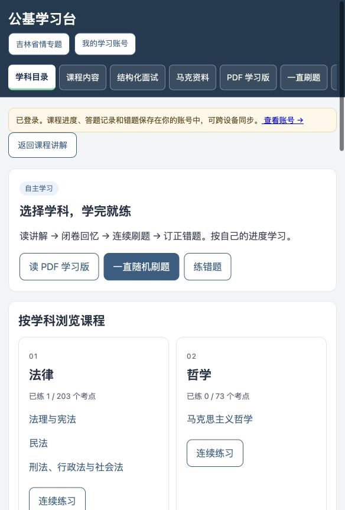
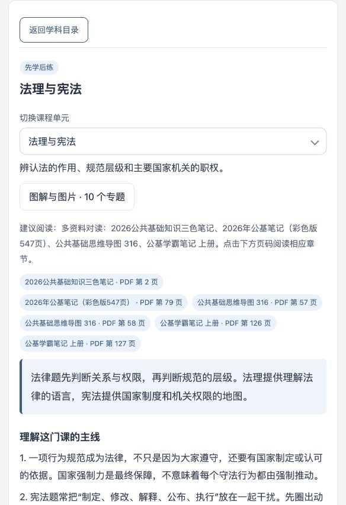
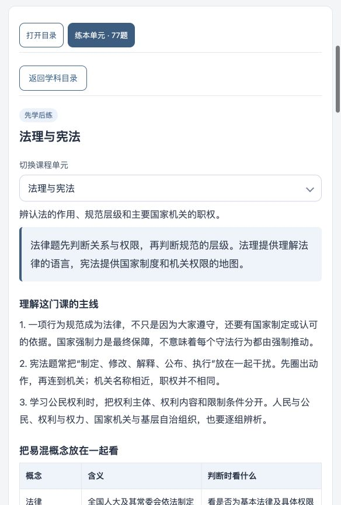
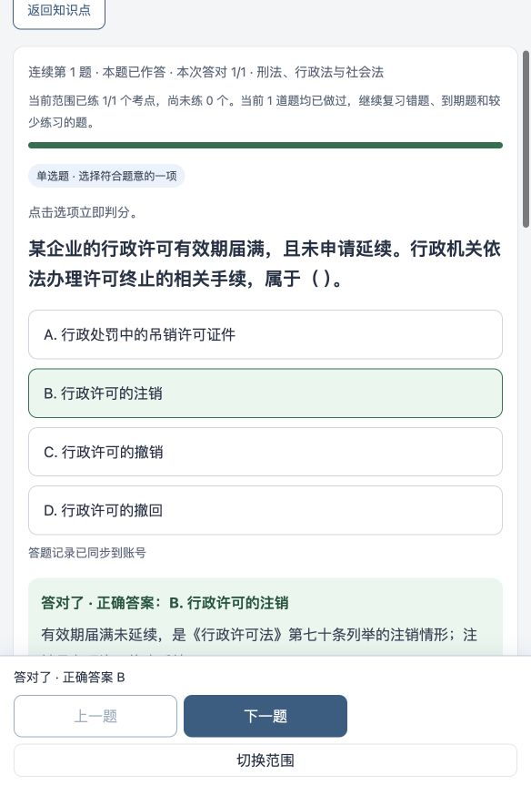
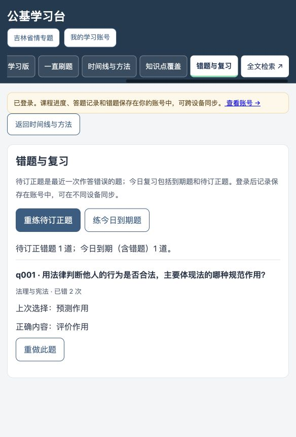
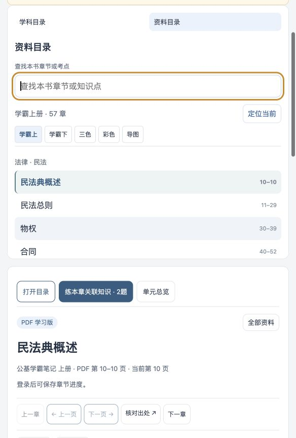
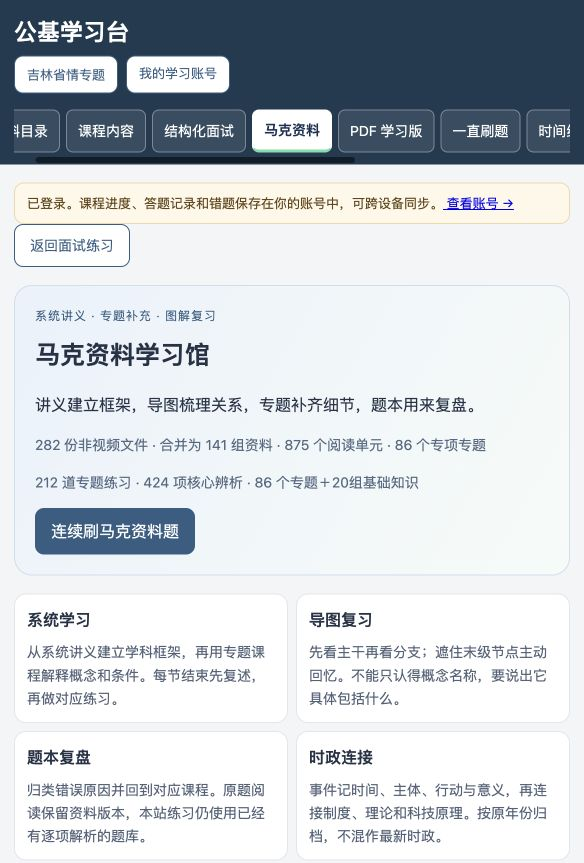
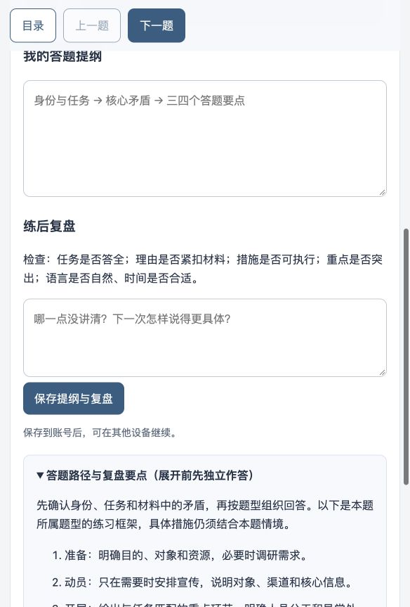
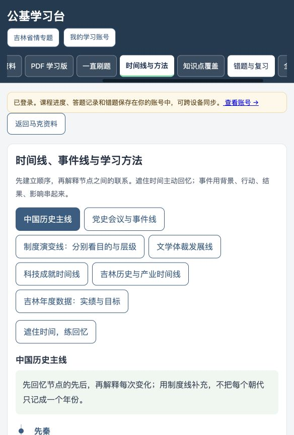

# 公基学习台整体审查与修复

审查日期：2026-10-07。线上版本作为修改前基线；修改后在本地完整 Worker 中验收。本站仍公开发布。

## 结论与范围

已修复阻碍学习路径的主要问题。结构与功能回归覆盖 1,223 道题、1,576 个已整理考点、197 个课程专题、303 个 PDF 章节、141 组马克资料和8个面试模块。内容人工核对聚焦基础定义、旧讲义的年份、行政许可、社会保险、民事主体以及抽样题目的干扰项；不代表全部 PDF 已逐字校勘或题目全部达到真题难度。

### 内容修改

- 订正5条基础知识记录：哈雷彗星预计2061年回归；社会保险的五类制度、风险及居民参保边界；行政许可注销的法定情形；两份资料的法人定义与能力起止。
- 修复12处标题，包含“注销许”之外的残缺目录标题和“神州九号”错字。原资料文字和扫描页保留，不覆盖原文。
- 重写5道旧题，改用正式问题、情境和同类选项。例如行政许可用注销、撤销、撤回、吊销四项对照，去掉拼接其他概念造成的语病。
- 重新编写33项马克资料干扰事实及辨析，覆盖哲学、管理、事业单位考核、宪法与法理、货币层次。减少明显荒谬的选项，改为主体、层级、条件和概念关系混淆。
- 共更新42道题的文字或解析，其中40道题更新版本。历史版本保留，旧浏览器未同步答案仍按原题版本判分。多选答案数量保持2、3、4项分布。
- PDF 对应页面展示订正及权威依据；马克讲义中原M1旧口径处展示2025年新口径提示。

依据：[NASA哈雷彗星](https://science.nasa.gov/solar-system/comets/1p-halley/)、[社会保险法](https://www.samr.gov.cn/zw/zfxxgk/fdzdgknr/bgt/art/2023/art_e81d115419b4463ebb59ec46467fb136.html)、[行政许可法](https://www.moe.gov.cn/jyb_sjzl/sjzl_zcfg/zcfg_qtxgfl/202110/t20211029_575972.html)、[民法典](https://www.court.gov.cn/zixun/xiangqing/233181.html)、[宪法](https://www.npc.gov.cn/c2/c30834/201905/t20190521_281393.html)、[事业单位工作人员考核规定](https://chinajob.mohrss.gov.cn/c/2023-03-01/370681.shtml)。

## 流程逐步审查

### 1. 首页选择学科 — 正常，入口更直接

原状：学习记录和说明占据首屏，学科目录在下方。修复：压缩页头；将记录移到目录后；先展示学习、刷题、错题入口和学科卡片。窄屏导航可横向滚动，当前栏自动进入可见范围。

### 2. 课程讲解与目录 — 正常，闭环已修复

原状：来源链接先于讲解，练习入口位于长页面底部。修复：讲解优先；顶部提供打开目录、当前单元/专题/考点练习；目录保留展开与定位功能。知识点与刷题间往返保留答案、选择顺序及当前题。

### 3. 连续刷题、反馈、回看与错题 — 正常

修复：否定问法单独提示；单选立即显示结果，同时更新答对数与已练考点数；多选保持提交前可修改、整组判分。保留四项解析、专题拓展、固定下一题及上一题。服务器与发布题目的选项、答案和版本完全对应；旧题记录按原版本处理。

### 4. PDF与马克资料阅读 — 正常，目录与范围更准确

原状：“查看目录”实际滚到正文；窄屏目录上方说明挤占章节空间；无本章题时练习偷偷扩大到整个学科。修复：PDF页优先展示学霸上下册；目录入口真正定位目录并露出章节；本章练习按考点及每个选项的出处关联，范围显示“本章关联知识”，没有关联题时明确提示。原页图仍保留，马克图片加载失败时给出原图重试入口。

### 5. 结构化面试 — 正常，复盘路径更完整

修复：返回按钮明确区分目录、练习和框架；新题重置计时器，回看同题框架保留计时；提纲和复盘草稿在当前标签页刷新后可恢复，按账号隔离；显式登录前的草稿在登录后保留供保存。增加可折叠的题型答题步骤与常见失误，先独立作答再展开。历史人物和政策按原题年代阅读。没有把题型框架冒充每道题的标准答案。

### 6. 时间线、账号与继续学习 — 正常，有验证边界

时间线与方法页面包含历史、党史、制度、文学、科技、吉林事件和年度指标，可遮住时间主动回忆。登录保留原学习位置和选定的练习范围；加载失败提供重试。完整本地 Worker 验证登录、D1错题保存、刷新读取、重复请求去重与退出；多设备并发和不同账号隔离由接口回归覆盖。本次没有使用用户的生产账号写入测试答题，也没有重新完成一次生产 OAuth授权或在两台真实设备之间测试。

## 验证记录

- `qa/verify.mjs`：连续抽题、立即判分、四项解析、专题关联、目录返回、浏览器前后退、题型范围、旧题版本、同步去重、账号隔离、面试提纲与计时等通过。
- 全覆盖题库：2,755种答案组合判分检查；马克题库：2,014种答案组合判分检查；另检查已改写的历史马克题版本仍可保存。
- 新增整体审查回归：教材订正、发布端与判分端完全一致、章节包含次要出处、无章节题不扩大范围、登录恢复马克哲学范围、否定提示、面试计时、刷新草稿、跨账号隔离。
- `qa/http-account.mjs`：真实本地Worker和D1登录、答题、刷新、幂等和退出通过。
- 已验收默认桌面视口与584px窄屏；截图是实际浏览器截图，未重绘。截图中用户状态来自本地测试账号。
- 键盘焦点增强、表单标签与目标分钟关联已实现；未做完整屏幕阅读器或WCAG符合性认证。
- 缓存版本现在包含整个课程和题库，内容修订可及时加载。

## 后续内容边界

仍有旧讲义OCR文字与题库需要按专题持续人工校勘；目前的覆盖指已整理考点配题，不能据此声称覆盖全部原书细节或未来考试考点。教材原图和出处继续保留用于核对。
